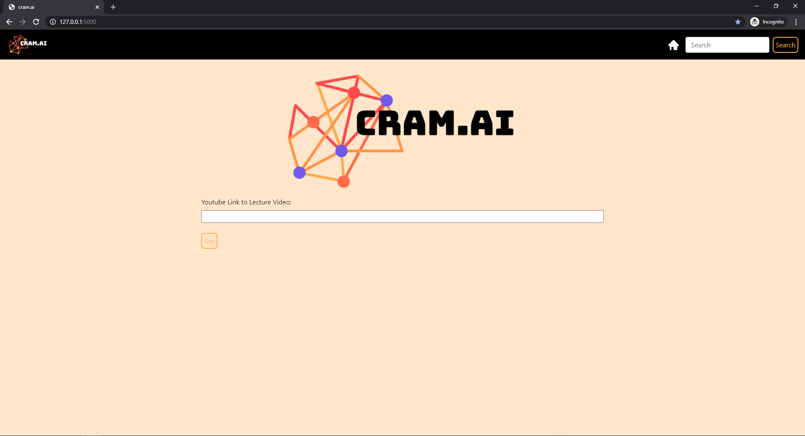
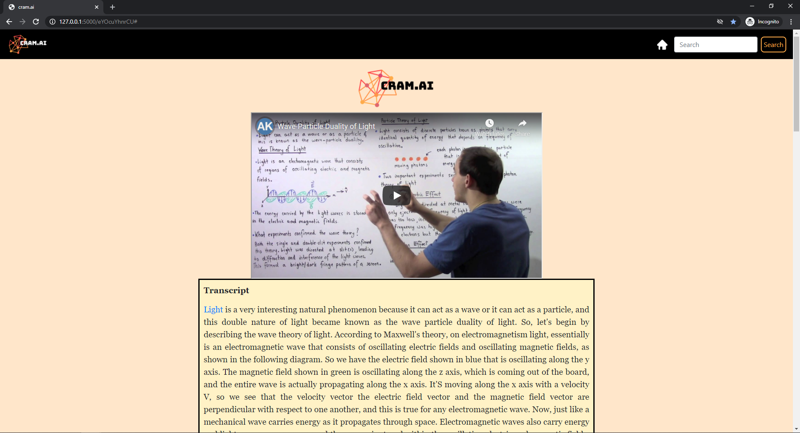
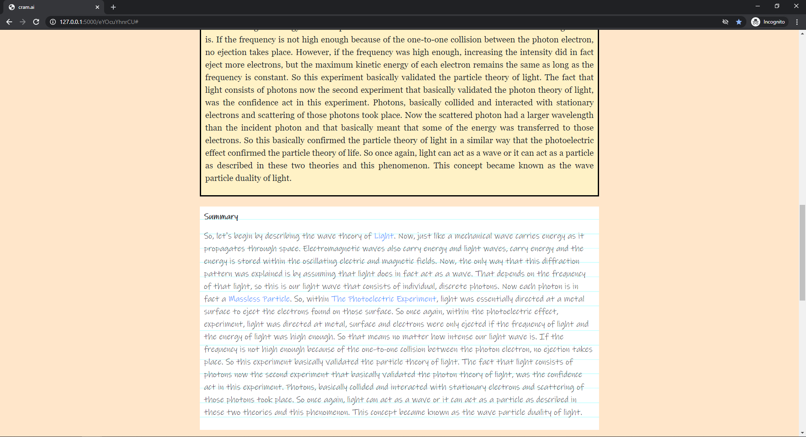
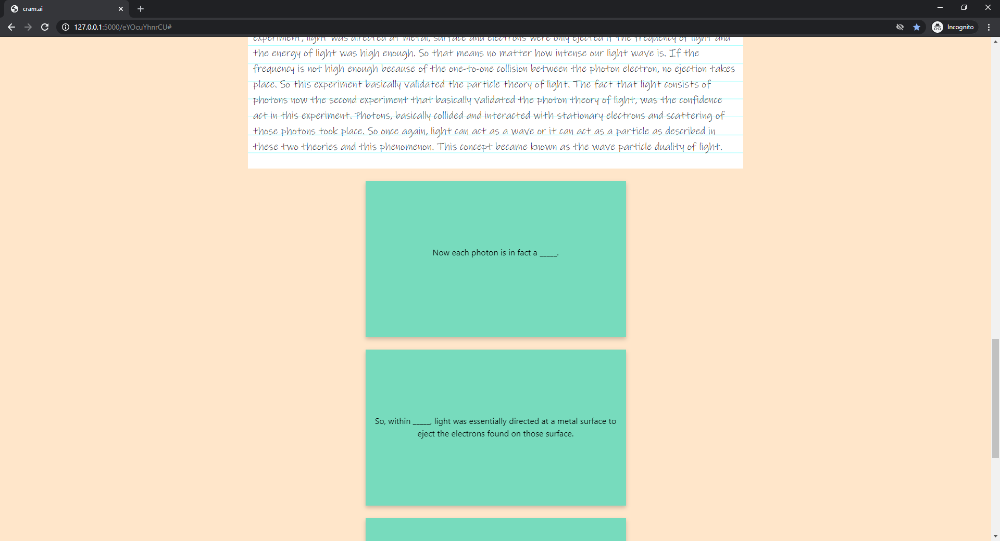

## Inspiration
The COVID-19 pandemic has resulted in schools and universities to shut down all over the world and adopt an online learning system. As a result, education has changed dramatically, with the distinctive rise of online lecture videos and digital learning platforms. Research suggests that online learning has been shown to increase retention of information, and take less time, meaning the changes coronavirus have caused might be here to stay.  
  
  
*Statista,* Niall McCarthy (2020). *[COVID-19's Staggering Impact On Global Education](https://www.statista.com/chart/21224/learners-impacted-by-national-school-closures/)*  
  
While our transition to online learning has been fairly smooth, various barriers to online lecture videos still obstruct our way, including technical issues, distractions, time management, and the lack of in-person activity. In hopes of helping students overcome these obstacles and analyze lecture videos in an automated manner, I built ***cram.ai.***

## What it does
***cram.ai*** is a web platform that uses natural language processing to analyze educational lecture videos, intended to help students analyze university lectures and test their knowledge. From the link to the YouTube video, ***cram.ai*** is able to extract the transcript of the lecture, process its contents, comprehensively summarize the lecture, and generate flashcards with fill-in-the-blanks questions and answers on core concepts.
  
  
  
  
  
  
  
  
  
## Dependencies & How To
### Install YouTube Transcript API
```
pip install youtube-transcript-api
```
### Install NLTK
```
pip install nltk
```
### Install Google Cloud Language Client Library
```
pip install google-cloud-language
```
### Install Flask
```
pip install flask
```
### Run cram.ai
```
python app.py
```

## How I built it
***cram.ai*** utilizes the **YouTube Transcript API** in **Python** to extract the transcript of a video and uses a pre-trained recurrent neural network model to punctuate the transcript. In order to summarize the transcript, cram.ai uses **NLTK** library in Python to perform natural language processing and obtain the sentences that contain the core concepts. Using **Google Cloud Language,** ***cram.ai*** is able to perform entity analysis to produce flashcards and Wikipedia pages for entities. The website is built using **Flask** and **Bootstrap.**

## Challenges I ran into
The toughest obstacle of this project was generating the summary. There are several ways to generate a summary to a text, with the applicability of each method dependent on different contexts and situations. For the purposes of summarizing lectures, I decided it is most efficient to identify keywords and assign greater score to parts of the video that talks about the keywords. Because the English language is so complicated and filled with exceptions, it was a challenging task to account for all the corner cases.

## Accomplishments that I'm proud of
This was my first project where I had to implement intense natural language processing operations from scratch. I am happy that I was able to produce what I had envisioned and I'm confident that I will be able to take on even more complicated projects in the future.

## What I learned
***cram.ai*** helped me understand various advanced methods of natural language processing and allowed me to get familiar with the different features of natural language processing libraries in Python. Additionally, working on this project also helped me enhance my web development skills.
  
## What's next for cram.ai
***cram.ai*** has a long way to go, but I'm confident that this platform can affect the online learning community in a positive way. Plans for future improvements include:
- enhancing the natural language processing methods
- supporting different languages
- reading whiteboards from frames of lecture videos
- adding scientific equation recognition